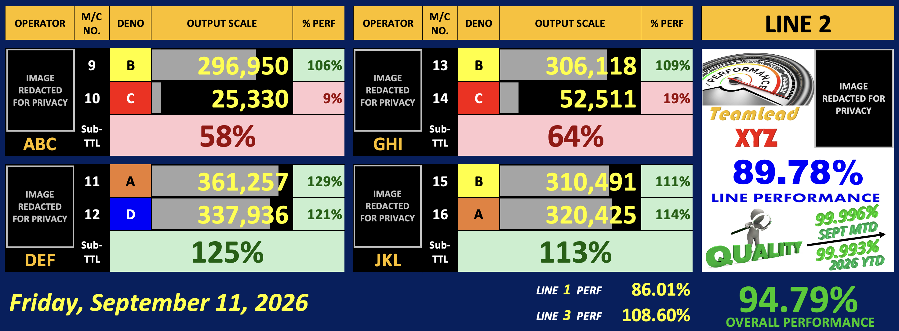

| [home page](https://cmustudent.github.io/tswd-portfolio-templates/) | [data viz examples](dataviz-examples) | [critique by design](critique-by-design) | [final project I](final-project-part-one) | [final project II](final-project-part-two) | [final project III](final-project-part-three) |

# Title: Evaluating and Redesigning a Real-Time Production Performance Dashboard

## Project Overview

This project evaluates a real-time production performance dashboard used in Coin Production Line 2 as a case study in data visualization design. The dashboard is displayed on a large monitor within the production area and serves as a primary source of operational information for operators, supervisors, and managers. It communicates production output, operator performance, quality indicators, and target attainment in real time to support daily production management.

Using data visualization principles discussed in class, the project examines how effectively the dashboard communicates critical information and supports operational decision-making. The analysis identifies both strengths and areas for improvement related to visual hierarchy, usability, readability, and cognitive load. Based on this assessment, a redesign concept will be proposed to improve clarity, focus user attention on the most important performance indicators, and enhance the dashboard's ability to support timely and informed decisions on the shop floor.

## Objective

To assess the effectiveness of an existing manufacturing performance dashboard and develop redesign recommendations that improve communication, situational awareness, and decision support for production personnel.

## Step one: the visualization

<h4>Shift Production Performance (Per Line)</h4>

<em>Note: Certain information, including the operator's name, photograph, and DENO (product category), has been anonymized or altered due to confidentiality requirements.</em>

## Step two: the critique
_Don't forget to complete the Google Form found on the assignment page.  You can summarize your thoughts here._

## Step three: Sketch a solution

## Step four: Test the solution

_Before you conduct your interviews, prepare a simple script.  Use this as a guide and as a way to take notes as you go forward. Come up with your own list of questions you want to ask for the selected visualization. Keep the questions broad so you can get the most value out of your feedback. Then, document answers to your questions here._

Questions to ask (modify these for your own interviews): 

- Can you tell me what you think this is?

- Can you describe to me what this is telling you?

- Is there anything you find surprising or confusing?

- Who do you think is the intended audience for this?

- Is there anything you would change or do differently?

Results: 

_Don't identify or share personally identifiable information (PII) about the people you spoke to._

| Question | Interview 1 | Interview 2 |
|----------|-------------|-------------|
|          |             |             |
|          |             |             |
|          |             |             |

Synthesis: 

_What patterns in the feedback emerge?  What did you learn from the feedback?  Based on this feedback, come up with what design changes you think might make the most sense in your final redesign._

## Step five: build the solution

_Include and describe your final solution here. It's also a good idea to summarize your thoughts on the process overall. When you're done with the assignment, this page should all the items mentioned in the assignment page on Canvas(a link or screenshot of the original data visualization, documentation explaining your process, a summary of your wireframes and user feedback, your final, redesigned data visualization, etc.)._

## References
_List any references you used here._

## AI acknowledgements
_If you used AI to help you complete this assignment (within the parameters of the instruction and course guidelines), detail your use of AI for this assignment here._

